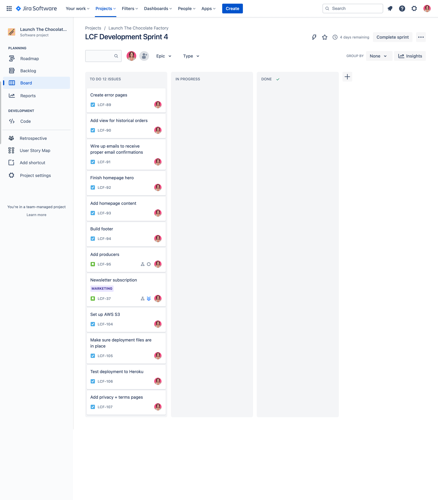

# The Chocolate Factory

[Live site](https://the-chocolate-factory.herokuapp.com/)


## Table of Contents

- [The Chocolate Factory](#the-chocolate-factory)
  - [Table of Contents](#table-of-contents)
- [Introduction](#introduction)
- [UX](#ux)
  - [Strategy](#strategy)
    - [The Problem](#the-problem)
    - [The Solution](#the-solution)
    - [Target Audience](#target-audience)
    - [Personas](#personas)
  - [Scope](#scope)
    - [User Expectations](#user-expectations)
    - [User Stories](#user-stories)
    - [User (Owner) Stories](#user-owner-stories)
  - [Structure](#structure)
  - [Skeleton](#skeleton)
  - [Surface](#surface)
    - [Colours](#colours)
    - [Fonts](#fonts)
    - [Images](#images)
- [Agile](#agile)
  - [Epics](#epics)
- [Features](#features)
  - [Header](#header)
  - [Footer](#footer)
  - [Homepage](#homepage)
  - [Producers](#producers)
  - [Products / Store](#products--store)
  - [Product Details](#product-details)
  - [Bag / Cart](#bag--cart)
  - [Checkout](#checkout)
  - [User Profiles](#user-profiles)
  - [Product Management](#product-management)
- [Marketing Strategy](#marketing-strategy)
  - [Branding](#branding)
  - [SEO](#seo)
  - [Keywords](#keywords)
  - [Newsletter](#newsletter)
  - [Social media](#social-media)
- [Testing](#testing)
- [Technologies used](#technologies-used)
  - [Languages](#languages)
  - [Libraries / Frameworks](#libraries--frameworks)
- [Running Locally](#running-locally)
  - [Prerequisites](#prerequisites)
  - [Installation](#installation)
- [Deployment](#deployment)
  - [Prerequisites](#prerequisites-1)
  - [Deployment to Heroku](#deployment-to-heroku)
- [Roadmap](#roadmap)
- [Credits](#credits)
  - [Media](#media)
  - [Code](#code)
- [Acknowledgements](#acknowledgements)

# Introduction

The Chocolate Factory is a B2C ecommerce website for the final project of the Code Institute diploma in Software Engineering.

The site provides role based permissions for users to interact with a central dataset. It includes user authentication, email validation and full CRUD functionality for approved users for Products and Producers.

The payment system uses Stripe. Please note that this website is for **educational purposes** only and the payment gateway is not set up to accept real payments. Do not enter any personal credit/debit card details when using the site.

When testing the site, please use the following from Stripe's testing documentation: 

- a Stripe test card number, such as `4242 4242 4242 4242`, or `4000 0582 6000 0005` for UK.
- a future expiry date, such as 04/24.
- any three-digit CVC.

*Go back to the [top](#table-of-contents)*

---

# UX

## Strategy

### The Problem

When researching the craft chocolate industry, I discovered that consumers are craving quality in their chocolate, but the production of fine flavour cacao may decrease in the coming years. This is due to cacao farmers not making much more of a profit on fine cacao to justify the extra hassle that the fine cacao crop requires.

### The Solution

Let's push the focus to the cacao farmers. These are the people that take care of the crop and allow the rest of the world to experience the joy and comfort of chocolate. They should be recognised and celebrated.

My re-imagined version of The Chocolate Factory will source fine cacao producers specifically, and invest in the business relationship to support them to not only keep going, but to thrive. We will share their faces and their stories, championing and celebrating the hard work that they do.

Through these relationships and with the support of the cacao producers, we can provide the highest quality craft chocolate and help to rebuild the fine cacao industry with an awesome website and marketing :fist:.

### Target Audience

Consumers that love and appreciate quality chocolate, where it comes from, the care that goes into making it and the health benefits it provides.

### Personas

Arthur and Marie, both 44, married, parents. Arthur is an old-fashioned romantic that likes to treat his wife with flowers and chocolates, and will make sure to find something that she's happy with. Marie is environmentally conscious and enjoys high-quality products. She works in Marketing and appreciates good branding too.

Nina, 26, single. Works remotely and travels the world - a "digital nomad". Loves getting lost in the cultures of different countries and is aware of difficulties that some communities have. She donates to charities often that help to boost economies in developing countries, helping entrepreneurs to start businesses for example. She always looks for companies with a similar mission to buy gifts for family and friends back home.

*Go back to the [top](#table-of-contents)*

---

## Scope

### User Expectations
1. As a user I expect the app to be responsive.
2. As a user I expect the app to be accessible.
3. As a user I expect my data to be secure.

### User Stories
4. As a consumer, I want to see an interesting homepage with information on the store and the type of products it sells.
5. As a consumer, I want to subscribe to a newsletter to receive updates about the store.
6. As a consumer, I want to register my profile so I can save my personal information for future shopping.
7. As a consumer, I want to view the list of products available so I can see what the store has to offer.
8. As a consumer, I want to see the products by category to narrow down my search.
9.  As a consumer, I want to filter the products to narrow down my search.
10. As a consumer, I want to search products so I can find something specific.
11. As a consumer, I want to add products to my cart so I can save them for purchasing later.
12. As a consumer, I want to remove products from my cart if I change my mind.
13. As a consumer, I want to adjust the quantities of items in my card so I can buy more/less of the same item.
14. As a consumer, I want a checkout process so I can review my cart and add my details to complete my purchase.
15. As a consumer, I want to provide my card details so I can pay for the products in my cart.
16. As a consumer, I want to have my payment processed so I can complete my order.
17. As a consumer with a profile, I want my details to be autofilled to make purchases quicker and easier.
18. As a consumer, I want to see feedback on my actions, such as order completion, to confirm what action I've taken.

### User (Owner) Stories
19. As the store owner, I want to add products to the store as our range evolves and we add variety.
20. As the store owner, I want to update products when prices change and ensure the description is up to date.
21. As the store owner, I want to delete products when they're no longer available.
22. As the store owner, I want to send newsletters to our mailing list to share store news and updates.

I ranked the user stories by order of importance and how feasible/viable they are to complete. This let me chart the resulting numbers (see priority chart below) to help work out whether or not to include the features in the project given the constraints. The chart was created in a [Jupyter notebook with `matplotlib`](/docs/planning/priority-chart.md).

The priorities are "critical", "need", "nice to have", "want". I made sure to get all of the "critical" and "needed" features into the first version of the app, and any "nice to haves" that I had time for. The "wants" can be added to a later version.

Story no. | Feature | Importance | Feasibility/Viability | Priority
:---: | --- | :---: | :---: | ---
1 | Responsive design | 21 | 21 | critical
2 | Accessible design | 20 | 17 | critical
3 | Secure data | 19 | 5 | need
4 | Awesome homepage | 4 | 20 | nice to have
5 | Newsletter subscribe | 5 | 2 | want
6 | Create a profile | 6 | 22 | need
7 | View products | 22 | 19 | critical
8 | Product category pages | 12 | 18 | need
9 | Product filters | 11 | 13 | nice to have
10 | Search form | 8 | 12 | nice to have
11 | Add products to cart | 16 | 11 | need
12 | Remove products from cart | 7 | 10 | nice to have
13 | Edit qty of products in cart | 3 | 4 | want
14 | Cart review and checkout | 15 | 8 | need
15 | Provide payment details | 17 | 7 | need
16 | Process payment | 18 | 6 | need
17 | Autofill saved data at checkout | 1 | 3 | want
18 | Action feedback | 9 | 9 | need
19 | Add products to store | 14 | 16 | critical
20 | Update products in store | 13 | 15 | need
21 | Remove products from store | 10 | 14 | need
22 | Send newsletters | 2 | 1 | want

<details><summary>Priority chart</summary>

</details>

*Go back to the [top](#table-of-contents)*

---

## Structure

**User journey diagram**

Thanks to Lucid app for helping me to create the diagram of the user journeys.

 `Blue = sub pages`

 `Light blue = logged in only`

 `Light green = superuser only`


**Database models**

Thanks to DrawSQL for helping me to create the diagram of the models.


*Go back to the [top](#table-of-contents)*

---

## Skeleton

-- coming soon

*Go back to the [top](#table-of-contents)*

---

## Surface

I wanted to create a modern and vibrant brand for this project to help it to stand out within other chocolate brands that tend to be childish or old-fashioned.

These are the keywords to lead the brand design:

- Bright
- Fun
- Modern
- Friendly

### Colours

Inspired by murals, ethnic art and sunshine, I settled on the following colour palette.


### Fonts

The logo and main font throughout the site uses Alegreya Sans. It's an easy to read font, with just enough character to make it different, modern and unique.

The Alegreya font family: "...follows humanist proportions and principles, and achieves a ludic and harmonious paragraph through elements carefully designed in an atmosphere of diversity." - I think this fits perfectly with the brand keywords!

### Images

The photographs used in throughout the app are all wonderful photographs from Unsplash.

I wanted to capture "real life" photos for the caceo producers, to help them to be relatable. Credits for the individual photographers are listed at the bottom of this readme.

*Go back to the [top](#table-of-contents)*

---

# Agile

I used Jira to manage this project. Using Agile development methodologies, the project was broken up into Epics. These Epics roughly translate to apps within the Django project. Each User Story was added to it's relevant Epic, and each User Story was further broken down into smaller tasks.

## Epics

- Products
- Profiles
- Cart / bag
- Homepage
- Checkout
- Marketing

<details><summary>First sprint</summary>

</details>
<details><summary>Second sprint</summary>

</details>
<details><summary>Third sprint</summary>

</details>
<details><summary>Fourth sprint</summary>

</details>
<details><summary>Demonstration of Epic (LCF-32: Marketing) -> User Story (LCF-37: Newsletter subscription) -> Tasks (LCF-100 to LCF-103)</summary>

</details>

*Go back to the [top](#table-of-contents)*

---

# Features

Everything that was scheduled to be added to the app has been implemented. With the addition of the Producers app.

-- coming soon

## Header

## Footer

## Homepage

## Producers

## Products / Store

## Product Details

## Bag / Cart

## Checkout

## User Profiles

## Product Management

*Go back to the [top](#table-of-contents)*

---

# Marketing Strategy

## Branding

Brand assets help to keep customers engaged on a site. Remaining consistent with the branding, and keeping it friendly and of a high quality, helps customers to trust the brand and are therefore more likely to make a purchase.

The brand is explained in more detail in the [Surface](#surface) section.

## SEO

Most people will find a website via a search engine, so it’s good to cover SEO to make sure the site is accessible by search engines. The site has a robots.txt file to allow search engine spiderbots to crawl the site and allow it to be ranked in search results. It also has a sitemap to help the spiderbots to crawl the site faster and fetch all relevant content. Lastly, the site has testimonials on the home page, and privacy policy and terms and conditions pages to build trust and improve search engine rankings.

## Keywords

Keyword research is an ongoing task that involves checking Google results/tools and using external SEO tools such as SEMrush and Ubersuggest. Keywords are selected by tracking what is trending, keeping an eye on what keywords competitors are using, and selecting a mixture of both long and short tail keywords to use for advertising campaigns and to use within site content.

The meta tags and descriptions have relevant information and keywords and the site is connected to Google Analytics to be able to use Google's helpful keyword finder. In a future version, the addition of a blog with keyword-filled posts would also help to improve SEO, as well as implementing Google Ads.

## Newsletter

Visitors to the site do not need to be customers to sign up to the newsletter. Any user can sign up from the footer of any page on the site, adding their email to a Mailchimp mailing list. This helps the business to share information with potential customers, including sales/offers and increase conversions.

## Social media

Social media marketing is a great way to become identifiable in a target market. And adds extra links in search engines for the business. For this site, a Facebook business page has been created, carrying over the branding to match the website.

 -- coming soon

*Go back to the [top](#table-of-contents)*

---

# Testing

Please see the [Testing page](TESTING.md) for information on testing and validation.

*Go back to the [top](#table-of-contents)*

---

# Technologies used

- Version control: Git + Github
- Deployment: Heroku
- Database: PostgreSQL
- Media + static: AWS S3
- Payment gateway: Stripe

## Languages

- HTML5
- CSS3
- Python
- JavaScript / JQuery

## Libraries / Frameworks

- Django 3.2
- Bootstrap 5.2
- Font Awesome 6

*Go back to the [top](#table-of-contents)*

---

# Running Locally

## Prerequisites

- Python 3.10.1

## Installation

1. Clone the Github repo to the desired location on your computer.
   ```sh
   git clone git@github.com:lucywoodman/the-chocolate-factory.git
   cd the-chocolate-factory
   ```
2. Create and run a Python virtual environment in terminal.
   ```sh
   python3 -m venv env
   . env/bin/activate
   ```
3. Install the Python dependencies from `requirements.txt`.
   ```sh
   pip3 install -r requirements.txt
   ```
4. Create an `env.py` based on the `sample-env.py` file.
   1. Create and add a [Django secret key](https://django-secret-key-generator.netlify.app/).
   2. If you'd like to test checkout payments, you'll need a [Stripe account](https://stripe.com/en-gb).
   3. If you'd like to test newsletter functionality, you'll need a [Mailchimp account](https://mailchimp.com/).
5. Make migrations to prepare the database. This will create a `db.sqlite3` in the root. Remove the flags when happy to proceed.
   ```sh
   python3 manage.py makemigrations --dry-run
   python3 manage.py migrate --plan
   ```
6. Import the database.
   ```sh
   python3 manage.py loaddata db.json
   ```
7. Create a new superuser.
   ```sh
   python3 manage.py createsuperuser
   ```
8. Run the site locally.
   ```sh
   python3 manage.py runserver
   ```

*Go back to the [top](#table-of-contents)*

---

# Deployment

## Prerequisites

- Have the project running locally (see [Running Locally](#running-locally)).
- A [Heroku account](https://signup.heroku.com/).
- [Heroku CLI](https://devcenter.heroku.com/articles/heroku-cli#install-the-heroku-cli).
- An [AWS account](https://aws.amazon.com/).

For full functionality:

- A [Stripe account](https://stripe.com/en-gb) for the payment gateway.
- A [Mailchimp account](https://mailchimp.com/) for the newsletter signup.
- A [Gmail account](https://www.google.com/intl/en-GB/gmail/about/) for email SMTP.

## Deployment to Heroku

1. In the development environment, make sure the requirements are up to date with `pip3 freeze --local > requirements.txt`.
2. Also check that the `.gitignore` file lists everything that should not be pushed to production, such as `env.py`.
3. In terminal, login to Heroku. Then run the following commands:
   ```sh
   heroku create fancy-new-app --region eu # create an app called fancy-new-app
   heroku addons:add heroku-postgresql # add postgresql database addon
   ```
4. Set the following environment variables on Heroku:
   ```sh
   heroku config:set AWS_ACCESS_KEY_ID='' # AWS S3
   heroku config:set AWS_SECRET_ACCESS_KEY='' # AWS S3
   heroku config:set DATABASE_URL='' # postgresql database from heroku
   heroku config:set EMAIL_HOST_PASS='' # gmail smtp
   heroku config:set EMAIL_HOST_USER='' # gmail smtp
   heroku config:set HOST='fancy-new-app.herokuapp.com' # the heroku app URL or live domain
   heroku config:set MAILCHIMP_API_KEY='' # mailchimp
   heroku config:set MAILCHIMP_DATA_CENTER='' #mailchimp
   heroku config:set MAILCHIMP_EMAIL_LIST_ID='' # mailchimp
   heroku config:set SECRET_KEY='' # the Django secret key
   heroku config:set STRIPE_PUBLIC_KEY='' # stripe
   heroku config:set STRIPE_SECRET_KEY='' # stripe
   heroku config:set STRIPE_WH_SECRET='' # stripe
   heroku config:set USE_AWS='True' # for media/static to be collected from AWS S3
   ```
5. Create a `Procfile` to setup Heroku with gunicorn and run migrations. It should contain the following:
   ```sh
   web: gunicorn base_project.wsgi
   release: python manage.py migrate
   ```
6. Heroku should have automatically created an empty git repo in your Heroku app when the app was created above. Else you'll need to [manually add a Heroku remote](https://devcenter.heroku.com/articles/git).
7. When the remote is good to go, push the project to Heroku (assuming the branch is called `main`).
   ```sh
   git push heroku main
   ```
8. [optional] You may need to make migrations before running migrate again to bring Postgres up to date. Remove the flags when happy to proceed.
   ```sh
   heroku run python3 manage.py makemigrations --dry-run
   heroku run python3 manage.py migrate --plan
   ```
9.  When the deployment has succeeded, you can optionally create a new superuser:
    ```sh
    heroku run python manage.py createsuperuser
    ```
10. You can also optionally import the database if you've pushed it to Heroku:
    ```sh
    heroku run python manage.py loaddata db.json
    ```
    Else, tweak the `settings.py` file to connect to the Heroku PostgreSQL database and make migrations directly. Don't forget to change it back though! 

*Go back to the [top](#table-of-contents)*

---

# Roadmap

As this is an educational project, it won't be maintained in the future. Therefore no roadmap exists. However, if it were a live site, some features that I would have liked to implement are listed below.

- Stock control.
- Better form validation.
- CMS / product management dashboard for superusers.
- User permissions / groups to allow staff to have non-breaking access to the CMS.
- Link up user profiles and subscription list.
- Further improve user experience.
- A blog to help draw traffic to the site.

*Go back to the [top](#table-of-contents)*

---

# Credits

## Media

[Unsplash](https://unsplash.com/) is used for the photography on the site. The license is copyright-free.
Below are the images I used.

- [Brooke Cagle](https://unsplash.com/photos/8jp-6SjVibM)
- [Duy Pham](https://unsplash.com/photos/Cecb0_8Hx-o)
- [Etty Fidele](https://unsplash.com/photos/oJpkjWcScyg)
- [Eye for Ebony](https://unsplash.com/photos/aZzXKGcyWqk)
- [Jhon David](https://unsplash.com/photos/3WgkTDw7XyE)
- [Tyler Morgan](https://unsplash.com/photos/WSrgO-8GYgo)

## Code

This project was pieced together from my own knowledge with help from Code Institute's resources and the reference material below.

- [Python's documentation](https://docs.python.org/3/index.html)
- [Django's documentation](https://docs.djangoproject.com/en/3.2/)
- [Bootstrap's documentation](https://getbootstrap.com/docs/5.2/getting-started/introduction/)
- Hat tip to Justyna of Tiny Struggles for the [blog post on decimals](https://tinystruggles.com/posts/django_decimals/).

*Go back to the [top](#table-of-contents)*

---

# Acknowledgements

I would like to take the opportunity to thank:

- My family, friends and colleagues for their advice, support and help with testing.
- My mentor for their feedback, advice and support.

*Go back to the [top](#table-of-contents)*