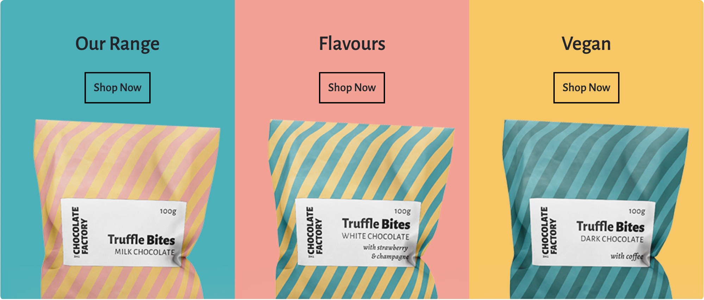

# The Chocolate Factory

[Live site](https://the-chocolate-factory.herokuapp.com/)


## Table of Contents

- [The Chocolate Factory](#the-chocolate-factory)
  - [Table of Contents](#table-of-contents)
- [Introduction](#introduction)
- [UX](#ux)
  - [Strategy](#strategy)
  - [Marketing Strategy](#marketing-strategy)
  - [Scope](#scope)
  - [Structure](#structure)
  - [Skeleton](#skeleton)
  - [Surface](#surface)
- [Agile](#agile)
  - [Epics](#epics)
  - [Sprints](#sprints)
- [Features](#features)
  - [Header](#header)
  - [Footer](#footer)
  - [Homepage](#homepage)
  - [Producers](#producers)
  - [Products / Store](#products--store)
  - [Product Details](#product-details)
  - [Bag / Cart](#bag--cart)
  - [Checkout](#checkout)
  - [Order Confirmation / history](#order-confirmation--history)
  - [User Profiles](#user-profiles)
  - [Product Management](#product-management)
  - [Error Pages](#error-pages)
- [Marketing Strategy Implementation](#marketing-strategy-implementation)
  - [Branding](#branding)
  - [SEO](#seo)
  - [Keywords](#keywords)
  - [Newsletter](#newsletter)
  - [Social media](#social-media)
- [Testing](#testing)
- [Technologies used](#technologies-used)
  - [Languages](#languages)
  - [Libraries / Frameworks](#libraries--frameworks)
- [Running Locally](#running-locally)
  - [Prerequisites](#prerequisites)
  - [Installation](#installation)
- [Deployment](#deployment)
  - [Prerequisites](#prerequisites-1)
  - [Deployment to Heroku](#deployment-to-heroku)
- [Future Development](#future-development)
- [Credits](#credits)
  - [Media](#media)
  - [Code](#code)
- [Acknowledgements](#acknowledgements)

# Introduction

The Chocolate Factory is a B2C e-commerce website for the final project of the Code Institute diploma in Software Engineering.

The site provides role based permissions for users to interact with a central dataset. It includes user authentication, email validation and full CRUD functionality for approved users for Products and Producers.

The payment system uses Stripe. Please note that this website is for **educational purposes** only and the payment gateway is not set up to accept real payments. Do not enter any personal credit/debit card details when using the site.

When testing the site, please use the following from Stripe's testing documentation: 

- a Stripe test card number, such as `4242 4242 4242 4242`, or `4000 0582 6000 0005` for UK.
- a future expiry date, such as 04/24.
- any three-digit CVC.

*Go back to the [top](#table-of-contents)*

---

# UX

## Strategy

### The Problem

When researching the craft chocolate industry, I discovered that consumers are craving quality in their chocolate, but the production of fine flavour cacao may decrease in the coming years. This is due to cacao farmers not making much more of a profit on fine cacao to justify the extra hassle that the fine cacao crop requires.

### The Solution

Let's push the focus to the cacao farmers. These are the people that take care of the crop and allow the rest of the world to experience the joy and comfort of chocolate. They should be recognised and celebrated.

My re-imagined version of The Chocolate Factory will source fine cacao producers specifically, and invest in the business relationship to support them to not only keep going, but to thrive. We will share their faces and their stories, championing and celebrating the hard work that they do.

Through these relationships and with the support of the cacao producers, we can provide the highest quality craft chocolate and help to rebuild the fine cacao industry with an awesome website and marketing :fist:.

### Target Audience

Consumers that love and appreciate quality chocolate, where it comes from, the care that goes into making it and the health benefits it provides.

### Personas

Arthur and Marie, both 44, married, parents. Arthur is an old-fashioned romantic that likes to treat his wife with flowers and chocolates, and will make sure to find something that she's happy with. Marie is environmentally conscious and enjoys high-quality products. She works in Marketing and appreciates good branding too.

Nina, 26, single. Works remotely and travels the world - a "digital nomad". Loves getting lost in the cultures of different countries and is aware of difficulties that some communities have. She donates to charities often that help to boost economies in developing countries, helping entrepreneurs to start businesses for example. She always looks for companies with a similar mission to buy gifts for family and friends back home.

*Go back to the [top](#table-of-contents)*

---

## Marketing Strategy

The main goal of the company is to increase sales to help "pay it forward" to the cacao producers and their communities. To increase sales, we need to raise awareness of the brand and allow the products to be available to a much larger number of people. This is where the website comes in.

Having a strong brand and a solid, trustworthy and easy to use website creates a good foundation for the company to build its online presence, massively increasing its reach in comparison to a handful of shop fronts across the country.

With the website as an asset and a newsletter email list as a starting point, we can then share the brand on social media or online advertising, continue to evolve the SEO, and build out additional features (such as a blog, educational resources and charity campaigns) to help increase traffic to the site. We could run social media competitions and email campaigns.

*Go back to the [top](#table-of-contents)*

---

## Scope

### User Expectations
1. As a user I expect the app to be responsive.
2. As a user I expect the app to be accessible.
3. As a user I expect my data to be secure.

### User Stories
4. As a consumer, I want to see an interesting homepage with information on the store and the type of products it sells.
5. As a consumer, I want to subscribe to a newsletter to receive updates about the store.
6. As a consumer, I want to register my profile so I can save my personal information for future shopping.
7. As a consumer, I want to view the list of products available so I can see what the store has to offer.
8. As a consumer, I want to see the products by category to narrow down my search.
9. As a consumer, I want to filter the products to narrow down my search.
10. As a consumer, I want to search products so I can find something specific.
11. As a consumer, I want to add products to my cart so I can save them for purchasing later.
12. As a consumer, I want to remove products from my cart if I change my mind.
13. As a consumer, I want to adjust the quantities of items in my cart so I can buy more/less of the same item.
14. As a consumer, I want a checkout process so I can review my cart and add my details to complete my purchase.
15. As a consumer, I want to provide my card details so I can pay for the products in my cart.
16. As a consumer, I want to have my payment processed so I can complete my order.
17. As a consumer with a profile, I want my details to be autofilled to make purchases quicker and easier.
18. As a consumer, I want to see feedback on my actions, such as order completion, to confirm what action I've taken.

### User (Owner) Stories
19. As the store owner, I want to add products to the store as our range evolves and we add variety.
20. As the store owner, I want to update products when prices change and ensure the description is up to date.
21. As the store owner, I want to delete products when they're no longer available.
22. As the store owner, I want to send newsletters to our mailing list to share store news and updates.

I ranked the user stories by order of importance and how feasible/viable they are to complete. This let me chart the resulting numbers (see priority chart below) to help work out whether or not to include the features in the project given the constraints. The chart was created in a [Jupyter notebook with `matplotlib`](/docs/planning/priority-chart.md).

The priorities are "critical", "need", "nice to have", "want". I made sure to get all of the "critical" and "needed" features into the first version of the app, and any "nice to haves" that I had time for. The "wants" may be added to a later version.

Story no. | Feature | Importance | Feasibility/Viability | Priority
:---: | --- | :---: | :---: | ---
1 | Responsive design | 21 | 21 | critical
2 | Accessible design | 20 | 17 | critical
3 | Secure data | 19 | 5 | need
4 | Awesome homepage | 4 | 20 | nice to have
5 | Newsletter subscribe | 5 | 2 | want
6 | Create a profile | 6 | 22 | need
7 | View products | 22 | 19 | critical
8 | Product category pages | 12 | 18 | need
9 | Product filters | 11 | 13 | nice to have
10 | Search form | 8 | 12 | nice to have
11 | Add products to cart | 16 | 11 | need
12 | Remove products from cart | 7 | 10 | nice to have
13 | Edit qty of products in cart | 3 | 4 | want
14 | Cart review and checkout | 15 | 8 | need
15 | Provide payment details | 17 | 7 | need
16 | Process payment | 18 | 6 | need
17 | Autofill saved data at checkout | 1 | 3 | want
18 | Action feedback | 9 | 9 | need
19 | Add products to store | 14 | 16 | critical
20 | Update products in store | 13 | 15 | need
21 | Remove products from store | 10 | 14 | need
22 | Send newsletters | 2 | 1 | want

<details><summary>Priority chart</summary>

</details>

*Go back to the [top](#table-of-contents)*

---

## Structure

**User journey diagram**

Thanks to Lucid app for helping me to create the diagram of the user journeys.

 `Blue = sub pages`

 `Light blue = logged in only`

 `Light green = superuser only`


**Database models**

Thanks to DrawSQL for helping me to create the diagram of the models.


*Go back to the [top](#table-of-contents)*

---

## Skeleton

-- coming soon

*Go back to the [top](#table-of-contents)*

---

## Surface

I wanted to create a modern and vibrant brand for this project to help it to stand out within other chocolate brands that tend to be childish or old-fashioned.

These are the keywords to lead the brand design:

- Bright
- Fun
- Modern
- Friendly

### Colours

Inspired by murals, ethnic art and sunshine, I settled on the following colour palette.


### Fonts

The logo and main font throughout the site uses [Alegreya Sans](https://fonts.google.com/specimen/Alegreya+Sans). It's an easy to read font, with just enough character to make it different, modern and unique.

The Alegreya font family: "...follows humanist proportions and principles, and achieves a ludic and harmonious paragraph through elements carefully designed in an atmosphere of diversity." - I think this fits perfectly with the brand keywords!

### Images

The photographs used in throughout the app are all wonderful photographs from Unsplash.

I wanted to capture "real life" photos for the caceo producers, to help them to be relatable. Credits for the individual photographers are listed at the bottom of this readme.

### Bootstrap

I opted to include Bootstrap 5.2 as part of the project. This allowed me to override Sass variables easily and compile the CSS locally, and also to completely exclude any modules that I wasn't using to help remove CSS bloat.

The SCSS files are within `/static/scss/`. I set the theme colours and font in `_variables.scss` and the other custom styles in `_custom.scss`. These are then compiled along with Bootstrap into a single `base.css` file in `/static/css/`.

*Go back to the [top](#table-of-contents)*

---

# Agile

I used Jira to manage this project. Using Agile development methodologies, the project was broken up into Epics. These Epics roughly translate to apps within the Django project. Each User Story was added to it's relevant Epic, and each User Story was further broken down into smaller tasks.

## Epics

- Products
- Profiles
- Cart / bag
- Homepage
- Checkout
- Marketing

## Sprints

<details><summary>First sprint</summary>

</details>
<details><summary>Second sprint</summary>

</details>
<details><summary>Third sprint</summary>

</details>
<details><summary>Fourth sprint</summary>

</details>
<details><summary>Demonstration of Epic (LCF-32: Marketing) -> User Story (LCF-37: Newsletter subscription) -> Tasks (LCF-100 to LCF-103)</summary>

</details>

*Go back to the [top](#table-of-contents)*

---

# Features

Everything that was scheduled to be added to the app has been implemented. With the addition of the Producers app.

## Header

On opening the site, users will be welcomed by the bright, warm and yellow header.

- The header has a free delivery threshold banner, to let users know that they can get free shipping if they place an order over £30.
- On larger screens, the logo sits in the top left. This is moved to an offcanvas (slide in) menu on smaller screens to reduce the header size.
- On larger screens, there is a search form in the centre. This is also moved to the offcanvas (slide in) menu on smaller screens.
- The "Account" button displays a dropdown menu that provides links for "Register" and "Login", allowing users to either register for a new account, or login with an existing one. Once logged in, the links update to "My Profile" and "Logout". If logged in as a superuser, there is also a "Product Management" link available here.
- The bag button opens up a mini version of the bag page. If there are no items in the bag, it will show a button to "Continue shopping". If there are items, it will display a summary of these, along with a subtotal, delivery charge and grand total.
- The main navigation contains the "Home", "Full Range", "Flavours", "Vegan" and "Producers" links, helping users to easily navigate to the main parts of the site. 
- On smaller screens, the main navigation is replaced with a "hamburger" icon on the left side. Clicking on the hamburger button reveals the offcanvas menu, containing the logo, search form and main navigation. Leaving just the "Account" and bag buttons visible for easy access.

:woman_technologist: User stories: [1](#user-expectations), [2](#user-expectations), [3](#user-expectations), [10](#user-stories)


## Footer

The footer compliments the primary yellow colour of the site by using a dark blue.

- The "keep in touch" section provides social media icons that (would) connect to the company's various social media accounts. These are external links and open in a separate tab for convenience, and to allow the user to return to the site easily.
- There's a button to subscribe to the newsletter. This opens a popup modal window so the user can enter their email address. This is connected to Mailchimp. If the user has not already subsribed, they will see a success message. If they have already subscribed, they will see a message stating this.
- Links to the main sections of the site are repeated in the footer, with the addition of "Sitemap", "Privacy Policy" and "Terms & Conditions". These three pages help SEO by allowing spiderbots to crawl the site easily, and providing more trust, for both users and search engines.
- The organisation logos and links of the Rainforest Alliance and Fairtrade sit on the right. Should the chocolate be manufactured, these two logos would also be on the packaging. They're the main organisations that work to protect the environment and the communities within countries that supply cacao.
- At the very bottom is the copyright, along with a disclaimer that this is an educational site only.

:woman_technologist: User stories: [1](#user-expectations), [2](#user-expectations), [5](#user-stories), [18](#user-stories), [22](#user-owner-stories)


## Homepage

The homepage is a celebration of the company, giving users a warm welcome to the site.

- Extending the header with the a gentle gradient from the yellow is the hero section, providing a brief introduction into the company and inviting the user to travel the world by trying the chocolates. The chocolates, the chocolate packaging and a photo of Mount Bromo in Indonesia (the location of one of the producers) provide in-brand imagery to draw the eye.
- Below the hero section are some featured links. These offer another opportunity to see the product branding, as well as giving users some quick links to a few product categories.
- Next is a section that elaborates further on the mission of the company, to support cacao producers and their communities. This section would be a great spot to add an "About us" or "Blog" link, so users can find out more about the mission and what the company does when it's not making chocolate.
- The testimonial section is next, going back to the lovely warm yellow background. This would be great with a small carousel of mutliple testimonials to provide extra social proof and build trust around the brand.
- Before we get to the footer, there is a section about the cacao producers. How they're selected and how the partnership benefits both the company and the producer. There is a link to learn more.
- Lastly, there's a pink banner with the company's Instragram account name and a link to encourage users to follow the account. Images really help to tell a story and provide context, so at this time, I imagine Instagram would be the strongest platform for this company. Though links to the other platforms are in the footer.

:woman_technologist: User stories: [1](#user-expectations), [2](#user-expectations), [4](#user-stories)





## Producers

The Producers page shares the names, location and stories of three producers. 

- Each Producer has a couple of short paragraphs explaining how and why they've become cacao farmers and what is important to them.
- The page celebrates the diversity and courage of people that run farms for a living. It puts into context what their lives are like. Helping people to understand that they absolutely deserve to be paid fairly and be supported, just like everyone else. With this information, users might be more likely to buy, knowing that their money is going to something more.
- When viewing this page as a superuser, extra buttons will be available. "Create producer", "Update producer" and "Delete producer". 
- "Create producer" will take the superuser to a simple form, allowing them to add further producers to the Producers page. 
- "Update producer" heads to the same form, but with the fields pre-filled with the information on that particular producer, ready to be edited. 
- "Delete producer" will open a popup modal asking for confirmation before deleting the selected producer. 

:woman_technologist: User stories: [1](#user-expectations), [2](#user-expectations)


## Products / Store

The Products page, or main shop page, displays the list of products available. 

- The product list can be sorted by price or name, ascending or descending. 
- The list can also be filtered by chocolate type, e.g. dark, milk, white, etc.
- If a user were to use the search form in the header, they would be brought to this same page, but with their search results visibile instead of the full list of products.
- The main navigation links for the categories and flavours also come to this page, with the relevant arguments added to the URL to make sure the correct products are displayed.
- When logged in as a superuser, extra buttons appear on the product images: "Update product" and "Delete product". These give the superuser quick access. The update button opens up the Product Management page for that particular product. The delete button opens a popup modal asking for confirmation before deleting the selected product.

:woman_technologist: User stories: [1](#user-expectations), [2](#user-expectations), [7](#user-stories), [8](#user-stories), [9](#user-stories), [10](#user-stories), [20](#user-owner-stories), [21](#user-owner-stories)


## Product Details

The Product Details page provides further information about the selected product. 

- There is a large image of the product on the left side.
- The price, weight and description are shown on the right side.
- The user has the option to choose a quantity and add the item to the bag. The quantity form has a minimum of 1 and a maximum of 99.
- There's an accordian section with information about the producer, the product ingredients, and any common allergens.
- - When logged in as a superuser, extra buttons appear above the product name: "Update product" and "Delete product". These give the superuser quick access, the same as on the Products page. The update button opens up the Product Management page for that particular product. The delete button opens a popup modal asking for confirmation before deleting the selected product.

:woman_technologist: User stories: [1](#user-expectations), [2](#user-expectations), [11](#user-stories), [13](#user-stories), [18](#user-stories), [20](#user-owner-stories), [21](#user-owner-stories)


## Bag / Cart

As mentioned above, the bag link in the header shows an offcanvas mini-bag. 

- The mini-bag displays a shipping threshold summary, as a progress bar, that shows a user how close they are to getting free shipping. This would encourage them to add more items to their bag.
- The user can also see the items in their bag, with their quantity and price.
- The mini-bag also shows the a subtotal, delivery charge and grand total for the bag.
- At the bottom of the mini-bag are three buttons: "Secure Checkout", "View Bag" and "Continue Shopping". Allowing users quick access to the most common actions after reviewing their bag.

When clicking on the "View Bag" button, the user is taken to a full-page view of their bag.

- The bag contents moves to the left, with a larger image and more space.
- The user also is now also able to adjust the quantity if they'd like. The same as the Product Details page, the quantity form has a minimum of 1 and a maximum of 99.
- There is also the option to remove an item from the bag with the trash icon.
- The right side shows very similar to the mini-bag, displaying the shipping threshold progress bar, subtotal, delivery charge and grand total.
- Lastly, two buttons: "Secure Checkout" for users to go ahead and complete their order. And "Continue Shopping" to return them to the main Products page.

:woman_technologist: User stories: [1](#user-expectations), [2](#user-expectations), [11](#user-stories), [12](#user-stories), [13](#user-stories), [14](#user-stories), [18](#user-stories)


## Checkout

The checkout page displays a bag summary on the right side, followed by the same subtotal, delivery cost and grand total that we've seen in the bag already.

- The left side shows a tidy form to collecting the user's contact and shipping information.
- Below this is an option to register an account or login to save the details to their profile.
- Once logged in, this paragraph changes to a checkbox "Save to profile". If checked, the user's contact and shipping information will be saved to the user's profile to be autofilled should they place another order.
- At the bottom of the form is the Stripe field for the user's payment information.
- Lastly, there is a button to "Return to Bag", should the user not be ready to checkout just yet. And a button for "Pay Now", with the payment amount underneath. Clicking on this will process the payment.
- The form uses Django's form validation and cross site request forgery protection.

:woman_technologist: User stories: [1](#user-expectations), [2](#user-expectations), [3](#user-expectations), [6](#user-stories), [14](#user-stories), [15](#user-stories), [16](#user-stories), [17](#user-stories), [18](#user-stories)


## Order Confirmation / history

Once a user has checked out, they'll see an order confirmation page. 

- The page thanks the user for placing their order, and let's them know that they will receive a confirmation via email as well. The email that's sent to the user is sent via Gmail SMTP and contains a summary of the order, along with a confirmation of the address that it will be shipped to.
- The confirmation page displays all of the order details in a tidy layout, clearly showing the information provided by the user (minus the payment details) and a summary of the order.
- It also displays the date and time of the order, and a truncated order number. The order number is very long and is included in the order confirmation email and the URL, so not required to be shown in full here.
- This same page can be visited via the Profile page too, to display historical orders. The only difference is that a historical order will have a note on the right to state that it's for reference only, and a button for the user to return to "Back to Profile".

:woman_technologist: User stories: [1](#user-expectations), [2](#user-expectations), [3](#user-expectations), [14](#user-stories), [15](#user-stories), [16](#user-stories), [18](#user-stories)


## User Profiles

When a user is logged in, they'll have access to the "My Profile" link from the "Account" button's dropdown menu.

- The left side of the page shows the saved information for that user. It's in the format of a form, so the user can make changes and update their profile using the "Update profile" button at the bottom. 
- The user will receive a message when the profile is updated successfully.
- The default delivery details are used to autofill the checkout form.
- If the user provides a first name, the Profile page's title will update from "Your Profile" to "Name's Profile", as shown in the screenshot below.
- The right side of the profile view displays any historical orders. Clicking on the order number of these will show the full order details, as mentioned above.

:woman_technologist: User stories: [1](#user-expectations), [2](#user-expectations), [3](#user-expectations), [6](#user-stories), [17](#user-stories), [18](#user-stories)


## Product Management

The product management page is available to superusers only.

- When logged in as a superuser, the "Product Management" link becomes available in the "Account" button's dropdown menu.
- The Product Management page offers a form for the superuser to add products to the store. See the [Database models](#structure) for an insight into how this form works. The "Type" and "Allergy" models use a many-to-many connection with the "Product" model so that we get checkboxes for these sections on the form.
- This same form is used if a superuser chooses to update a product, either from the Products page or the Product Detail pages. Except the fields will be pre-filled with the information for the product that was selected to be updated. 
- For updating, the header changes slightly to say "Update a product" instead of "Add a product". And there is a note in read stating which product the superuser is making changes to.

:woman_technologist: User stories: [1](#user-expectations), [2](#user-expectations), [19](#user-owner-stories), [20](#user-owner-stories)


## Error Pages

The app has custom error pages for 404, 403 and 500 errors.

- A 404 is a "page not found" error, and extremely common. Therefore, it's a great idea to add a custom error page to keep it user-friendly, and to lead users back to the main site.
- A 403 is an authentication error. This will show if a user attempts to access an area of the site that they're not allowed to see. 
- If a user is logged out and trying to access a forbidden page, such as `/producers/add/`, they'll be redirected to the login page. If they're already logged in, but not a superuser and try to access the same page, they'll see the 403 error page.
- A 500 error is a server error. Hopefully, this won't show up. But if it does, it will show the same template as the above two error pages.

:woman_technologist: User stories: [1](#user-expectations), [2](#user-expectations), [3](#user-expectations), [18](#user-stories)


*Go back to the [top](#table-of-contents)*

---

# Marketing Strategy Implementation

## Branding

Brand assets help to keep customers engaged on a site. Remaining consistent with the branding, and keeping it friendly and of a high quality, helps customers to trust the brand and are therefore more likely to make a purchase.

The brand is explained in more detail in the [Surface](#surface) section.

## SEO

Most people will find a website via a search engine, so it’s good to cover SEO to make sure the site is accessible by search engines. The site has a robots.txt file to allow search engine spiderbots to crawl the site and allow it to be ranked in search results. It also has a sitemap to help the spiderbots to crawl the site faster and fetch all relevant content. Lastly, the site has testimonials on the home page, and privacy policy and terms and conditions pages to build trust and improve search engine rankings.

## Keywords

Keyword research is an ongoing task that involves checking Google results/tools and using external SEO tools such as SEMrush and Ubersuggest. Keywords are selected by tracking what is trending, keeping an eye on what keywords competitors are using, and selecting a mixture of both long and short tail keywords to use for advertising campaigns and to use within site content.

The meta tags and descriptions have relevant information and keywords and the site is connected to Google Analytics to be able to use Google's helpful keyword finder. In a future version, the addition of a blog with keyword-filled posts would also help to improve SEO, as well as implementing Google Ads.

## Newsletter

Visitors to the site do not need to be customers to sign up to the newsletter. Any user can sign up from the footer of any page on the site, adding their email to a Mailchimp mailing list. This helps the business to share information with potential customers, including sales/offers and increase conversions.

## Social media

Social media marketing is a great way to become identifiable in a target market. And adds extra links in search engines for the business. For this site, a Facebook business page has been created, carrying over the branding to match the website.


*Go back to the [top](#table-of-contents)*

---

# Testing

Please see the [Testing page](TESTING.md) for information on testing and validation.

*Go back to the [top](#table-of-contents)*

---

# Technologies used

- Version control: Git + Github
- Deployment: Heroku
- Database: PostgreSQL
- Media + static: AWS S3
- Payment gateway: Stripe

## Languages

- HTML5
- CSS3
- Python
- JavaScript / JQuery

## Libraries / Frameworks

- Django 3.2
- Bootstrap 5.2
- Font Awesome 6

*Go back to the [top](#table-of-contents)*

---

# Running Locally

## Prerequisites

- Python 3.10.1

## Installation

1. Clone the Github repo to the desired location on your computer.
   ```sh
   git clone git@github.com:lucywoodman/the-chocolate-factory.git
   cd the-chocolate-factory
   ```
2. Create and run a Python virtual environment in terminal.
   ```sh
   python3 -m venv env
   . env/bin/activate
   ```
3. Install the Python dependencies from `requirements.txt`.
   ```sh
   pip3 install -r requirements.txt
   ```
4. Create an `env.py` based on the `sample-env.py` file.
   1. Create and add a [Django secret key](https://django-secret-key-generator.netlify.app/).
   2. If you'd like to test checkout payments, you'll need a [Stripe account](https://stripe.com/en-gb).
   3. If you'd like to test newsletter functionality, you'll need a [Mailchimp account](https://mailchimp.com/).
5. Make migrations to prepare the database. This will create a `db.sqlite3` in the root. Remove the flags when happy to proceed.
   ```sh
   python3 manage.py makemigrations --dry-run
   python3 manage.py migrate --plan
   ```
6. Create a new superuser.
   ```sh
   python3 manage.py createsuperuser
   ```
7. Run the site locally.
   ```sh
   python3 manage.py runserver
   ```

*Go back to the [top](#table-of-contents)*

---

# Deployment

## Prerequisites

- Have the project running locally (see [Running Locally](#running-locally)).
- A [Heroku account](https://signup.heroku.com/).
- [Heroku CLI](https://devcenter.heroku.com/articles/heroku-cli#install-the-heroku-cli).
- An [AWS account](https://aws.amazon.com/).

For full functionality:

- A [Stripe account](https://stripe.com/en-gb) for the payment gateway.
- A [Mailchimp account](https://mailchimp.com/) for the newsletter signup.
- A [Gmail account](https://www.google.com/intl/en-GB/gmail/about/) for email SMTP.

## Deployment to Heroku

1. In the development environment, make sure the requirements are up to date with `pip3 freeze --local > requirements.txt`.
2. Also check that the `.gitignore` file lists everything that should not be pushed to production, such as `env.py`.
3. In terminal, login to Heroku. Then run the following commands:
   ```sh
   heroku create fancy-new-app --region eu # create an app called fancy-new-app
   heroku addons:add heroku-postgresql # add postgresql database addon
   ```
4. Set the following environment variables on Heroku:
   ```sh
   heroku config:set AWS_ACCESS_KEY_ID='' # AWS S3
   heroku config:set AWS_SECRET_ACCESS_KEY='' # AWS S3
   heroku config:set DATABASE_URL='' # postgresql database from heroku
   heroku config:set EMAIL_HOST_PASS='' # gmail smtp
   heroku config:set EMAIL_HOST_USER='' # gmail smtp
   heroku config:set HOST='fancy-new-app.herokuapp.com' # the heroku app URL or live domain
   heroku config:set MAILCHIMP_API_KEY='' # mailchimp
   heroku config:set MAILCHIMP_DATA_CENTER='' #mailchimp
   heroku config:set MAILCHIMP_EMAIL_LIST_ID='' # mailchimp
   heroku config:set SECRET_KEY='' # the Django secret key
   heroku config:set STRIPE_PUBLIC_KEY='' # stripe
   heroku config:set STRIPE_SECRET_KEY='' # stripe
   heroku config:set STRIPE_WH_SECRET='' # stripe
   heroku config:set USE_AWS='True' # for media/static to be collected from AWS S3
   ```
5. Create a `Procfile` to setup Heroku with gunicorn and run migrations. It should contain the following:
   ```sh
   web: gunicorn base_project.wsgi
   release: python manage.py migrate
   ```
6. Heroku should have automatically created an empty git repo in your Heroku app when the app was created above. Else you'll need to [manually add a Heroku remote](https://devcenter.heroku.com/articles/git).
7. If you've made any changes to any of the files in `/static/scss/`, you'll need to recompile them.
   ```sh
   sass static/scss/base.scss static/css/base.css
   ```
8. When the remote is good to go, push the project to Heroku (assuming the branch is called `main`).
   ```sh
   git push heroku main
   ```
9.  [optional] You may need to make migrations before running migrate again to bring Postgres up to date. Remove the flags when happy to proceed.
   ```sh
   heroku run python3 manage.py makemigrations --dry-run
   heroku run python3 manage.py migrate --plan
   ```
11. When the deployment has succeeded, you can optionally create a new superuser:
    ```sh
    heroku run python manage.py createsuperuser
    ```
12. You can also optionally import the database if you've pushed it to Heroku:
    ```sh
    heroku run python manage.py loaddata db.json
    ```
    Else, tweak the `settings.py` file to connect to the Heroku PostgreSQL database and make migrations directly. Don't forget to change it back though! 

*Go back to the [top](#table-of-contents)*

---

# Future Development

As this is an educational project, it will not be maintained in the future. However, if it were a live site, some features that I would like to implement are listed below.

- Stock control.
- Better form validation.
- CMS / product management dashboard for superusers.
- User permissions / groups to allow staff to have non-breaking access to the CMS.
- Link up user profiles and subscription list.
- Further improve user experience.
- A blog to help increase traffic to the site.

*Go back to the [top](#table-of-contents)*

---

# Credits

## Media

[Unsplash](https://unsplash.com/) is used for the photography on the site. The license is copyright-free.
Below are the images I used.

- [Brooke Cagle](https://unsplash.com/photos/8jp-6SjVibM)
- [Duy Pham](https://unsplash.com/photos/Cecb0_8Hx-o)
- [Etty Fidele](https://unsplash.com/photos/oJpkjWcScyg)
- [Eye for Ebony](https://unsplash.com/photos/aZzXKGcyWqk)
- [Jhon David](https://unsplash.com/photos/3WgkTDw7XyE)
- [Tyler Morgan](https://unsplash.com/photos/WSrgO-8GYgo)
- [Pukpik](https://unsplash.com/photos/aB46yUmsMp0)

## Code

This project was pieced together from my own knowledge with help from Code Institute's resources and the reference material below.

- [Python's documentation](https://docs.python.org/3/index.html)
- [Django's documentation](https://docs.djangoproject.com/en/3.2/)
- [Bootstrap's documentation](https://getbootstrap.com/docs/5.2/getting-started/introduction/)
- Hat tip to Justyna of Tiny Struggles for the [blog post on decimals](https://tinystruggles.com/posts/django_decimals/).

*Go back to the [top](#table-of-contents)*

---

# Acknowledgements

I would like to take the opportunity to thank:

- My family, friends and colleagues for their advice, support and help with testing.
- My mentor for their feedback, advice and support.

*Go back to the [top](#table-of-contents)*