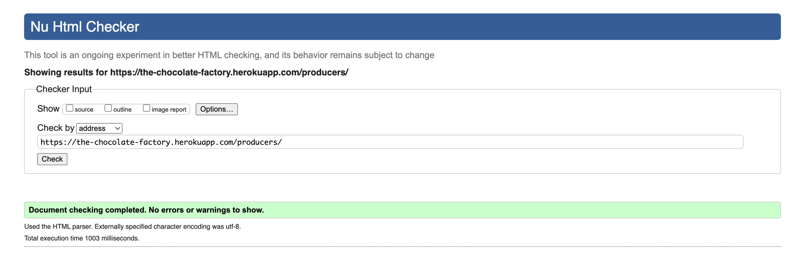
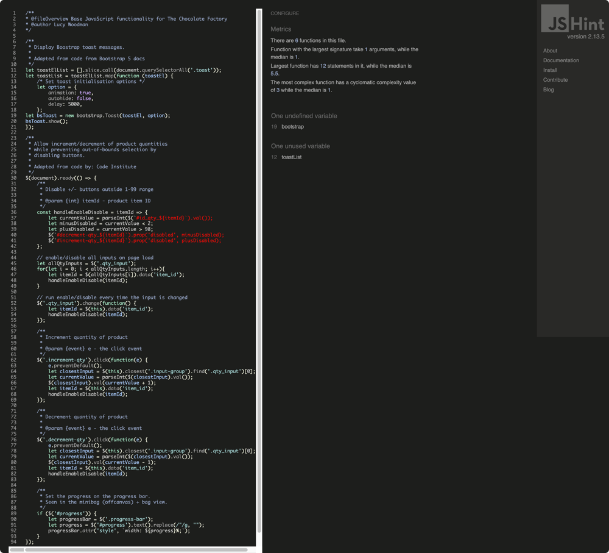

# The Chocolate Factory Testing

:arrow_left: [Return to the README](README.md)

## Table of Contents

- [The Chocolate Factory Testing](#the-chocolate-factory-testing)
  - [Table of Contents](#table-of-contents)
- [Performance](#performance)
  - [Google's Lighthouse Performance](#googles-lighthouse-performance)
- [Accessibility](#accessibility)
  - [Accessibility Validation](#accessibility-validation)
- [Code Validation](#code-validation)
  - [HTML Validation](#html-validation)
  - [CSS Validation](#css-validation)
  - [JS Validation](#js-validation)
  - [PEP8 Validation](#pep8-validation)
- [Testing](#testing)
  - [Manual Testing (BDD)](#manual-testing-bdd)
  - [Automated Testing (TDD)](#automated-testing-tdd)
- [Bugs](#bugs)

# Performance

## Google's Lighthouse Performance

[Google Lighthouse](https://developers.google.com/web/tools/lighthouse) was used to test the performance of the website.

Home page

*Go back to the [top](#table-of-contents)*

---

# Accessibility

## Accessibility Validation

The [WAVE WebAIM web accessibility evaluation tool](https://wave.webaim.org/) was used to ensure the website met high accessibility standards. All pages pass with 0 errors, except for the Profile page and Checkout page. This is due to the forms not using labels. With more time I can dig into this, however, for now it has been saved as an open issue on the Github repository.

*Go back to the [top](#table-of-contents)*

---

# Code Validation

## HTML Validation

The [W3C Markup Validation Service](https://validator.w3.org/) was used to validate the HTML of the website. For logged in pages, the page source was copied and pasted into the validator. All pages pass with 0 errors and 0 warnings.

Home

Register

Login

Products

Product Detail

Producers

Bag

Privacy Policy

Terms & Conditions

*Go back to the [top](#table-of-contents)*

---

## CSS Validation

The [W3C Jigsaw CSS Validation Service](https://jigsaw.w3.org/css-validator/validator) was used to validate the CSS of the website. The CSS passes with 0 errors.

*Go back to the [top](#table-of-contents)*

---

## JS Validation

[JSHint](https://jshint.com/) was used to validate the JavaScript/Jquery of the website. No issues were found.

Base JS

Quantity handler

Delete modal handler

Stripe handler

Country field handler

*Go back to the [top](#table-of-contents)*

---

## PEP8 Validation

A combination of the following Python packages was used to ensure the code is PEP8 compliant: flake8, autopep8 and black. After which `flake8 --statistics` was ran in VSCode terminal and the final flagged files were checked in [PEP8 Online](http://pep8online.com). The only issues found were a few longer lines in the project's settings.py.

*Go back to the [top](#table-of-contents)*

---

# Testing

## Manual Testing (BDD)

BDD, or Behaviour Driven Development, is the process used to test user stories in a non-technical way, allowing anyone to test the features of an app.

User Story | BDD Test | Pass
--- | --- | :---:
As a user I want to see an interesting homepage So that I can learn about the store and the type of products it sells | Given that I'm a new visitor to the website When I view/scroll down the homepage Then I should see what they sell and what they care about | :white_check_mark:
As a user I want to subscribe to a newsletter So that I can receive updates about the store | Given that I am not already subscribed When I click the "Click to subscribe" button in the footer and enter my email address Then I should see confirmation that I have subscribed to the newsletter | :white_check_mark:
As a user I want to register my profile So that I can save my personal information for future shopping | Given that I'm not already registered When I click on "Account" -> "Register" and submit my information Then I should see confirmation that my profile has been created and I should be able to login | :white_check_mark:
As a user I want to view the list of products available So that I can see what the store has to offer | Given that I'm on the homepage When I click on the "Explore Store" button or "Full Range" -> "All Products" Then I should be taken to the Products page where I can see all of the products available | :white_check_mark:
As a user I want to see the products filtered by category So that I can narrow down the products and find what I need easier | Given that I'm on the homepage When I click on "Full Range" and a category Then I should only see that particular category's products | :white_check_mark:
As a user I want to filter the products So that I can narrow down my search | Given that I'm on the Products page When I click on "Filter by" and choose an option Then I expect to only see the products related to that specific filter | :white_check_mark:
As a user I want to search for specific products So that I can avoid clicking through pages | Given that I want to search for "white chocolate" When I type this into the search form and click search Then I should only see products that mention "white chocolate" in their title or description | :white_check_mark:
As a user I want to add products to my bag So that I can save what I might purchase | Given that I'm on a Product Detail page When I click on "Add to bag" Then I should see confirmation that my item has been added to the bag and be able to see it in the mini-bag/Bag | :white_check_mark:
As a user I want to remove products from my bag So that I can edit the order before checking out | Given that my bag is not empty and I'm on the Bag page When I click on the trash icon Then I expect the item to be removed from the bag and to see confirmation of this | :white_check_mark:
As a user I want to edit the quantities of items in my bag So that I can edit the order before checking out | Given that my bag is not empty and I'm on the Bag page When I click on the plus or minus buttons, followed by "Update order" Then I should see the quantity and order totals update | :white_check_mark:
As a user I want to go through a checkout process So that I can review my bag and add my details to complete my purchase | Given that I'm on the mini-bag/Bag page When I click on "Secure Checkout" Then I should see a form where I can enter my details to start the checkout process | :white_check_mark:
As a user I want to provide card details So that I can pay for the products in my cart | Given that I'm on the Secure Checkout page When I've filled in my details and scrolled down Then I should see a section where I can enter my payment details | :white_check_mark:
As a user I want to have my payment processed So that I can complete my order | Given that I've entered my personal details and card details on the Secure Checkout page When I click the "Pay Now" button Then I should see confirmation that all is well and my order has been received | :white_check_mark:
As a user that's logged in I want my details to be autofilled at checkout So that I can make purchase quicker and easier | Given that I've already filled in my profile information When I next go to checkout Then I should see my details already populated in the checkout form | :white_check_mark:
As a user I want to see feedback on my actions So that I can get confirmation of the actions I've taken | Given that I'm taking action on the site When I complete the action I should see a notifcation letting me know what I've done/not done | :white_check_mark:
As a superuser I want to add products to the store So that I can offer products to seel and add new products in the future | Given that I'm a logged in superuser When I click on "Account" -> "Product Management" Then I should be able to complete the form and submit for new products to be added to the store | :white_check_mark:
As a superuser I want to update products So that I can keep them up to date | Given that I'm a logged in superuser and on the Products or Product Detail page When I click on "Update product" Then I should see a form to be able to edit that specific product | :white_check_mark:
As a superuser I want to delete products So that users won't buy unavailable products | Given that I'm a logged in superuser and on the Products or Product Detail page When I click on the "Delete product" button Then I should see a modal asking me for confirmation before I delete the product, then delete the product once I confirm | :white_check_mark:
As a superuser I want to send newsletters to our mailing list So that I can share store news | Given that I'm logged into the Mailchimp account When I view the contact list Then I should see a list of subscribers who I can then set up an email campaign for | :white_check_mark:

*Go back to the [top](#table-of-contents)*

---

## Automated Testing (TDD)

TDD, or Test Driven Development, was used throughout parts of the development process. Using Django's testing class, I created 44 tests which all pass. Using `coverage`, testing covers 73% of the code. Ideally, this would be above 90% with more time devoted to it.

*Go back to the [top](#table-of-contents)*

---

# Bugs

All fixed bugs use the "fix: " prefix in the commit message. Below is a list of everything stumbled upon during development, in date order.

Resolved | Bug | Fix | Commit
:---: | --- | --- | :---:
:white_check_mark: | Static files are returning 404s | Add `STATICFILES_DIRS` to settings | [commit](https://github.com/lucywoodman/the-chocolate-factory/commit/2ead92c490c8c378f58611a24ae3b40589535ff3)
:white_check_mark: | Elements are not using correct widths | Create custom widths | [commit](https://github.com/lucywoodman/the-chocolate-factory/commit/6616e23beab685b6ae3ba1034b13fb769aaab1ea)
:white_check_mark: | Mobile nav still showing on large screens | Add `d-none` classes | [commit](https://github.com/lucywoodman/the-chocolate-factory/commit/10237645b01a0cbfe4b5f22f209c3c7cfcd676bf)
:white_check_mark: | Offcanvas elements were not displaying correctly | Override z-index | [commit](https://github.com/lucywoodman/the-chocolate-factory/commit/d64ba1f6daf2fb9ff1a4cebe75a50731869f1d0d)
:white_check_mark: | Category title broken since switching to CBV | Update view context | [commit](https://github.com/lucywoodman/the-chocolate-factory/commit/509dd9cc74f00c9a8e8e53e943b688572cc575cc)
:white_check_mark: | Category context broken due to incorrect name | Update products view | [commit](https://github.com/lucywoodman/the-chocolate-factory/commit/d7987a85c6bf717741444ea12743791e536bc95e)
:white_check_mark: | Toast messages not displaying as expected | Close open-ended if statement in template | [commit](https://github.com/lucywoodman/the-chocolate-factory/commit/218c4cd508f3e09ae5a5d04a4a68a84f3493e3d8)
:white_check_mark: | Slug field shows when it shouldn't be seen | Remove slug field from modelform | [commit](https://github.com/lucywoodman/the-chocolate-factory/commit/7b5f94100102d13ceaa581169830f6b2f8f5ba7c)
:white_check_mark: | Form buttons don't submit | Move buttons to inside form tags | [commit](https://github.com/lucywoodman/the-chocolate-factory/commit/a4e9be1db1fff5707719da0fc8acf07a0548d78a)
:white_check_mark: | Checkout signals aren't working | Remove accidental dupliate function name | [commit](https://github.com/lucywoodman/the-chocolate-factory/commit/3efeb2619f3bbb402a0b08ac8cd19d308b5b537f)
:white_check_mark: | Heroku deployment fails | Update Procfile to use the project name instead of directory name | [commit](https://github.com/lucywoodman/the-chocolate-factory/commit/6681b64037fe6c8d99c4f51c3dc052aaaa22e945)
:white_check_mark: | Producer form isn't saving/updating images | Add `enctype` to the form in the template | [commit](https://github.com/lucywoodman/the-chocolate-factory/commit/3a4430914e236e6856d7c5751ed373e9abb9836c)
:white_check_mark: | Users can break the site by adding extortionate quantities | Limit product quantities in the view | [commit](https://github.com/lucywoodman/the-chocolate-factory/commit/d43d9c8a5987a6ca0ca6aa8e641367f7bdcbf031)
:white_check_mark: | Order number runs off the side of the page on small screens | Truncate the order number | [commit](https://github.com/lucywoodman/the-chocolate-factory/commit/53f54c5873c8ef57f66789e1150dd28a1aeb77c7)
:negative_squared_cross_mark: | Orders are created twice on Heroku (see below) | Increase time delay between retries | [commit](https://github.com/lucywoodman/the-chocolate-factory/commit/8958ac154a360230890b7718f8e223b2131eb9e9)
:white_check_mark: | HTML validation error: duplicate id + image without width | Rename id + give image width | [commit](https://github.com/lucywoodman/the-chocolate-factory/commit/07026453b652bb8eeb04b4ea1fef7214d285c303)
:white_check_mark: | Order confirmation email does not have £ or 2 decimal places | Add £ and floatformat to email template | [commit](https://github.com/lucywoodman/the-chocolate-factory/commit/b653068b4d77fca901fe65b2d611ff11e415cf0f)
:white_check_mark: | Redirect fails since updating HTTP methods | Update the HTTP method and retest | [commit](https://github.com/lucywoodman/the-chocolate-factory/commit/303b393a4607cbc7b52fd46c8363767f6f0b0c42)
:white_check_mark: | Checkout success / Order history details missing | Update template tags | [commit](https://github.com/lucywoodman/the-chocolate-factory/commit/74e8649155ddfef847cf0af71c0093e085dcddf1)
:white_check_mark: | Orders are created twice on Heroku (take 2) | Remove extra searches and search by PID only | [commit](https://github.com/lucywoodman/the-chocolate-factory/commit/da6e13edc86cb0c73170b7ad4810a151549456c0)

*Go back to the [top](#table-of-contents)*

---